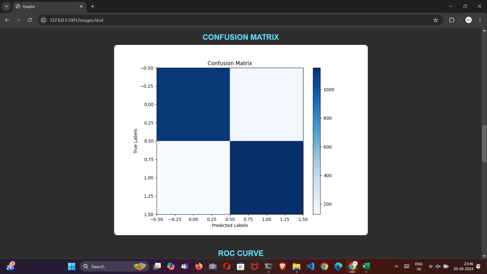

# Project Title

# *Deepfake Text Detection using Twitter Dataset*


### Problem Statement:
With the rise of AI-generated content and deepfake technology, misleading and fabricated text on social media platforms like Twitter has become a growing concern. Identifying such fake or bot-generated content is critical to preventing misinformation. However, distinguishing human-written tweets from deepfake-generated ones is challenging due to the sophistication of AI text generators.

This project aims to build a robust system capable of detecting deepfake text on Twitter using a combination of natural language processing (NLP) techniques and advanced deep learning architectures. By utilizing BERT for text embeddings and a custom CNN-LSTM model for classification, this project attempts to accurately differentiate between human and bot-generated tweets.


# Overview
This project is a secure web application for detecting deepfake text from tweets, built using Flask and MySQL for login authentication. After a successful login, users can input text to determine whether it is human or bot-generated. Additionally, users can dynamically interact with a GPT-2 bot, submit a generated tweet, and classify the text using the detection model.

The application also provides visualizations of training performance and logs user activity, including login time, logout time, and usage duration, stored in an Excel sheet.


### Steps to Use the Application

1. **Login Authentication**: 
   - The user accesses the web application and logs in using their credentials.
   - The login is handled through a secure Flask-based authentication system with MySQL as the database.

2. **Text Input for Detection**:
   - After logging in, the user can input a text or tweet into the text box provided.
   - The model processes the input and detects whether it is human or bot-generated.

3. **Interact with GPT-2 Bot**:
   - The user has the option to interact dynamically with a GPT-2 bot.
   - They can ask the bot to generate a tweet, copy that tweet, and then paste it into the detection text box for classification.

4. **View Training Graphs**:
   - Users can access graphs that display metrics like accuracy and loss, which were generated during the model's training process.

5. **Activity Logging**:
   - Each user’s activity, including their Gmail, login time, logout time, and usage duration, is logged and saved in an Excel sheet for later reference.

6. **Logout**:
   - Once done, the user can safely log out of the application.


# Model Architecture

- **BERT (Bidirectional Encoder Representations from Transformers)**: Pre-trained BERT model (`bert-large-uncased`) is used to extract rich text embeddings from the input tweets.
- **CNN (Convolutional Neural Network)**: A series of convolution layers are applied to extract features from the BERT embeddings, helping capture spatial patterns in the text.
  - Conv1: 512 filters
  - Conv2: 1024 filters
  - Conv3: 2048 filters
  - Pooling layers reduce dimensionality while preserving important features.
- **LSTM (Long Short-Term Memory)**: A bidirectional LSTM with 3 layers and 1024 hidden units processes the CNN output to capture sequential patterns over time.
- **Fully Connected Layer**: The final dense layer predicts whether the tweet is from a human or a bot.


## Key Components in Code
- **Flask**: A lightweight web framework used for building a simple web interface where users can input a tweet and get a prediction.
- **BERT Model**: Pre-trained `bert-large-uncased` model is used to convert text into high-dimensional vectors for further processing.
- **CNN-LSTM Model**: A custom architecture built with three convolution layers followed by an LSTM for sequence modeling.
- **Prediction Functionality**: Input text is tokenized using BERT's tokenizer, processed through the CNN-LSTM model, and classified as either bot-generated or human-written.
- **Text Storage**: The project saves classified texts in separate folders (`bot/` and `human/`) for future reference or analysis.


## 🔗 Links
[](https://aicraftalchemy.github.io/)
[](https://www.linkedin.com/in/lokesh-e-60a583201)


## 🛠 Skills
Machine Learning, Deep Learning ,Pytorch,NLP


## Installation
  
 ```bash
   python 3.11.9
   MySQL
```


    

# Learnings and Challenges
   
### Learnings
1. **Understanding BERT and Transfer Learning**: Utilizing BERT's pre-trained model for text embeddings highlighted the power of transfer learning in NLP, significantly improving the model's ability to understand and capture the semantic nuances of tweets.
   
2. **CNN and LSTM Synergy**: Combining CNNs with LSTMs provided an effective way to capture both spatial features and sequential dependencies in the text data. CNNs helped in extracting local patterns, while LSTMs captured long-term dependencies.

3. **Efficient Text Tokenization**: Tokenizing text using BERT's tokenizer required learning how to handle special tokens and padding, ensuring the input was in the correct format for processing through the model.

4. **Handling Imbalanced Data**: Working with real-world Twitter data often meant dealing with imbalanced classes (e.g., more human-generated text than bot-generated). Techniques like data augmentation or weighting the loss function were explored to manage this.

5. **Web Deployment with Flask**: Integrating the model into a Flask application provided insights into deploying deep learning models in real-world environments, allowing users to interact with the model through a web interface.

### Challenges
1. **Complexity of Deepfake Text Detection**: Differentiating between human-written and bot-generated text is inherently challenging due to the increasing sophistication of AI text generators. This complexity required fine-tuning the model and careful feature extraction.

2. **Model Overfitting**: Given the relatively small and noisy dataset of deepfake texts on Twitter, preventing overfitting was a key challenge. Regularization techniques like dropout and early stopping were critical in improving generalization.

3. **Training Time and Resource Constraints**: Training large models like BERT with additional CNN and LSTM layers required significant computational resources. Reducing training time while maintaining model performance was a constant trade-off.

4. **Handling Noisy Data**: Twitter data is inherently noisy, with incomplete, slang-filled, or abbreviated texts. Cleaning and preprocessing such data to ensure the model could learn effectively was a major hurdle.

5. **Real-time Prediction with Flask**: Serving a deep learning model in real-time for predictions required optimizing the Flask app for speed, ensuring that predictions could be generated quickly without compromising accuracy.


# Optimizations

1. **Text Preprocessing**: Applied better text cleaning (removing noise) and used data augmentation to handle class imbalance.
   
2. **Model Fine-Tuning**: Fine-tuned BERT on the Twitter dataset and used learning rate scheduling to optimize training.

3. **Regularization**: Added dropout and batch normalization to prevent overfitting and stabilize learning.

4. **Efficient Architecture**: Reduced CNN filters and used bidirectional LSTMs for better performance with less computational cost.

5. **Faster Inference**: Implemented batch processing in Flask and explored model quantization to improve inference speed.

6. **Class Weighting**: Adjusted class weights in the loss function to handle imbalanced data better.

## Run Locally

### Setup Instructions

1. **Clone the project:**

    ```bash
    git clone https://link-to-project
    ```

2. **Go to the project directory:**

    ```bash
    cd my-project
    ```

3. **Install dependencies:**

    ```bash
    pip install -r requirements.txt
    ```

4. **Start the servers:**

    - **Detection Server:**

      Navigate to the `detect&chatbot` folder and start the server:

      ```bash
      cd detect&chatbot
      python app.py  # Detection server will run
      ```

    - **GPT-2 Bot Server:**

      Navigate to the `chatbot` folder within `detect&chatbot` and start the GPT-2 bot server:

      ```bash
      cd chatbot
      python app.py  # GPT-2 bot server will run
      ```

    - **Login Server:**

      Navigate back to the `detect&chatbot` folder, then go to the `login` folder and start the login server:

      ```bash
      cd ..
      cd login
      python app.py  # Login server will run
      ```


### Accessing the Servers

Open a web browser and navigate to the following URL to access the servers:


- Login Server: [http://localhost:5002](http://localhost:5000)

### Interlinking the Servers

The servers are interlinked, allowing seamless communication between the detection system, GPT-2 bot, and login functionalities.
## Directory Structure

After running `cd my-project`, the structure will be:

```
detect&chatbot
    ├── chatbot
    │   └── app.py
    └── app.py
login
└── app.py
```

### Screenshots

Below are screenshots demonstrating the project:





These images showcase the functionality and user interface of the application.
## Support

For support, email aicraftalchemy@gmail.com 


## Feedback

If you have any feedback, please reach out to us at aicraftalchemy@gmail.com

Phone: +91 7661081043

